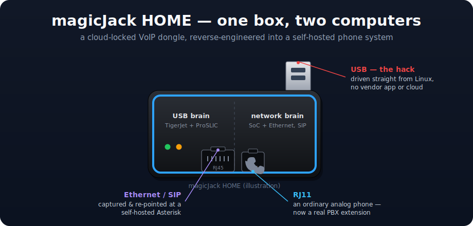

# Hacking a magicJack: reverse-engineering a cloud-locked VoIP dongle into a self-hosted phone system




> Driving a **magicJack HOME**'s analog phone port — dial tone, ring, hook, DTMF, and two-way
> audio — **straight from Linux over USB**, and pointing its networked SIP brain at a **self-hosted
> Asterisk PBX** instead of magicJack's cloud. Reverse-engineered from the vendor's own driver binary.
> No magicJack software, no subscription, no cloud.

**Keywords:** magicJack · reverse engineering · TigerJet · Silicon Labs ProSLIC · USB HID ·
SIP · Asterisk · self-hosted VoIP · ATA · FXS · telephony · hardware hacking · homelab

This repo is the full write-up of a homelab project with one theme: **take a cheap, cloud-locked
consumer phone gadget — the [magicJack](https://en.wikipedia.org/wiki/MagicJack) — and
reverse-engineer it until it does what *I* want instead of only what the vendor allows.** It turned
into a complete self-hosted telephone system: the magicJack's phone port now rings, dials, and
carries calls entirely from a Linux box, wired into my own PBX.

**If you searched "magicjack hacking" / "magicjack reverse engineering" — you're in the right place.**
Start with the plain-language story in **[`docs/the-magicjack-hack.md`](docs/the-magicjack-hack.md)**,
or jump straight to the flagship teardown in
**[`06-magicjack-usb-tigerjet/`](06-magicjack-usb-tigerjet/)**.

---

## Getting Started

**What you need:** a **magicJack HOME** (USB `06e6:c200`), a Linux box (Debian/Ubuntu), a plain analog
phone in the magicJack's RJ11 jack, and **any SIP PBX** you already run.

Plug the magicJack into USB, put a phone in its RJ11 jack, then:

```bash
git clone https://github.com/Gbrothers1/magicjack-hacking && cd magicjack-hacking
sudo ./setup.sh        # detects the device, installs deps, asks for your PBX, wires it up
```

`setup.sh` installs [`baresip`](https://github.com/baresip/baresip) (audio) + the
`mj-fxs-bridge.py` root daemon (FXS behavior), auto-detects the TigerJet sound card, generates the
config from your answers, and starts everything as systemd services. When it finishes: lift the handset
for dial tone, create the matching extension on your PBX, and dial it to ring the phone.

**It works with any SIP PBX — Asterisk, FreePBX, FreeSWITCH, 3CX, and others** — because the magicJack
is presented as a **standard SIP endpoint** (baresip is a plain SIP client; nothing magicJack-specific
touches your PBX). You just create a normal ulaw/alaw extension with the username + password you gave
the installer.

- Want to understand *how* it works, or do it from scratch by hand?
  → [`06-magicjack-usb-tigerjet/REPRODUCE.md`](06-magicjack-usb-tigerjet/REPRODUCE.md)
- Want the integration internals (baresip ↔ bridge daemon ↔ registers)?
  → [`03-magicjack-sip/README-fxs-usb.md`](03-magicjack-sip/README-fxs-usb.md)

---

## What's a magicJack, and why hack it?

A **magicJack** is a ~$40 gadget that gives you a home phone line over the internet. You plug a normal
telephone into its RJ11 jack, plug the magicJack into power/Ethernet (or a PC's USB port), pay a yearly
fee, and make calls. It's a classic **[ATA](https://en.wikipedia.org/wiki/Analog_telephone_adapter)**
(analog telephone adapter) — but a locked-down one: it only talks to magicJack's servers, only works
with magicJack's app/subscription, and gives you zero control over *your own* phone line.

Under the hood the magicJack HOME is really **two computers in one box**:

1. A **networked ATA brain** — a little SoC with an Ethernet port that speaks **SIP** (the standard
   VoIP protocol) to magicJack's cloud and owns your phone number. Active on **wall power**.
2. A **USB "softphone" front-end** — a *separate* chip set (a **TigerJet** USB controller +
   a **Silicon Labs Si321x ProSLIC** telephone-line chip) that, when you plug the magicJack into a PC
   instead of the wall, lets magicJack's Windows/Mac app drive the attached phone. Active on **USB**.

Both are welded shut to magicJack's software. **Why bother opening them?**

- **Ownership.** It's my hardware and my phone line. I want it to ring *my* PBX, route to *my*
  extensions, and keep working even if the vendor's cloud or subscription goes away.
- **Interoperability.** Standard SIP gear (Asterisk, softphones, trunks) should be able to use it.
  Reverse-engineering a product to make it interoperate with your own software is a normal,
  well-established, legal thing to do (see [ethics](#is-this-legal--ethical) below).
- **It's a great puzzle.** Two undocumented chips, a proprietary protocol, and a driver binary to
  take apart — an excellent way to learn USB, SIP, telephony, and reverse-engineering for real.

---

## The result: a hacked magicJack, driven entirely from Linux

The flagship hack frees the **USB brain**. Every analog-telephone function is now controlled from a
Python script talking to `/dev/hidraw`, with magicJack's software **never running** — all
hardware-verified with a real phone plugged in:

| Capability | How it's driven | Hardware-verified |
|---|---|---|
| **Line power** (dial tone + port LED) | ARM control register `reg0` bit0 + an `InitTjHardware` replay | ✅ dial tone in the earpiece, LED lit, repeatable on/off |
| **Ring the bell** | `reg0` bits 8–9 (`0x300`) → firmware generates the ~90 V ring voltage | ✅ the handset physically rang |
| **Hook detection** (handset up/down) | poll `reg0x14` **bit 31** | ✅ flips on lift/replace |
| **DTMF dialed digits** | on-chip decoder → `reg0x14` (valid flag + digit nibble) | ✅ exact match on live keypad presses |
| **Two-way audio** | standard USB Audio Class, ALSA card 1, native 8 kHz | ✅ voice both ways |
| **Caller-ID injection** | Bellcore Type-1 MDMF, Bell-202 FSK over USB audio (`tj_callerid.py`) | ✅ decoded flawlessly on a modem |
| **DTMF remover** | ARM register `reg0x14` bit4 | ✅ strips DTMF from line→host audio |
| **Digital audio loopback** | ARM register `reg0x40` bit4 | ✅ host playback→codec→host capture |
| **Tip/ring polarity reversal** | ARM register `reg0` bit16 | ✅ reversible; proves loop-current sense |
| **Asterisk extension** | `baresip` softphone (audio) + `mj-fxs-bridge.py` root daemon (FXS behavior) | ✅ live as **ext 200** |

The register protocol behind all of it was **not** guessed — it was read out of magicJack's own
publicly-downloadable **macOS driver binary**, which (unlike the stripped Windows DLL) still had all
its symbols. **[Reproduce it yourself →](06-magicjack-usb-tigerjet/REPRODUCE.md)**

A second wave went much deeper — a **~30-feature catalog** from the vendor binary, a **full 8 MB flash
dump from Linux**, the **SIP config crypto** (`SJEN`+RC4+zlib; the local `Profiles.db` decrypts to a bare
template, but the account is per-session-keyed and was *not* recovered), a **live-RAM firmware unpack**,
and a complete map of the **USB-vs-ATA "mode gate."** See
[`06-magicjack-usb-tigerjet/README.md`](06-magicjack-usb-tigerjet/README.md) §6–§10 and
[`CHANGELOG.md`](CHANGELOG.md).

---

## What got built (the short version)

| # | The move | Result |
|---|----------|--------|
| **A** | **Capture the ATA's SIP** by packet-sniffing it through the lab router | Learned the magicJack registers with a simple `user@domain`, **no password**, G.711 audio |
| **B** | **Self-host that SIP** in [Asterisk](https://www.asterisk.org/) | The networked magicJack now registers to **my** PBX instead of magicJack's cloud — keeps its number, runs entirely on my infrastructure |
| **C** | **Reverse-engineer the USB personality** from the macOS driver binary | Drove the analog phone port **entirely from Linux** — dial tone, ring, hook, DTMF, two-way audio — over an undocumented register protocol, no Windows/Mac app |
| **D** | **Wire the USB handset into Asterisk** as a real extension (200) | A physical phone on the magicJack now behaves like any PBX phone: dial out, ring on inbound, two-way voice |

---

## Navigation

New here? Read these in order:

1. **[`docs/the-magicjack-hack.md`](docs/the-magicjack-hack.md)** — the whole story in plain language,
   start to finish. No telephony or RE background needed. **The best on-ramp.**
2. **[`06-magicjack-usb-tigerjet/HOW-IT-WAS-HACKED.md`](06-magicjack-usb-tigerjet/HOW-IT-WAS-HACKED.md)**
   — the flagship methodology: the dead ends, the pivot to the macOS driver, and the differential
   register-discovery technique.
3. **[`06-magicjack-usb-tigerjet/REPRODUCE.md`](06-magicjack-usb-tigerjet/REPRODUCE.md)** — do it
   yourself: prerequisites, getting + disassembling the driver, the exact HID framings, the register
   map, and the tools.
4. **[`docs/HARDWARE.md`](docs/HARDWARE.md)** — the hardware reference: what the device is, its USB
   identity, chips, and firmware, each item tagged by confidence (verified / reported / unverified).

### The projects

Numbered in rough chronological order. The magicJack arc runs **02 → 03 → 06**.

| Dir | What it is |
|-----|-----------|
| [`02-cisco-1841/`](02-cisco-1841/) | The lab's edge router (a Cisco 1841) — and the vantage point used to **packet-capture the magicJack ATA's SIP** ([`magicjack-sip-notes.md`](02-cisco-1841/magicjack-sip-notes.md)). |
| [`03-magicjack-sip/`](03-magicjack-sip/) | **The self-hosted PBX.** An Asterisk server the magicJack ATA registers to instead of magicJack's cloud — plus an auto-attendant/IVR, voicemail, trunks, and the **USB-FXS integration**. |
| [`06-magicjack-usb-tigerjet/`](06-magicjack-usb-tigerjet/) | ⭐ **The USB reverse-engineering.** The full teardown of the magicJack's USB personality and the tools that drive the phone port from Linux. **The flagship hack.** |

See [`CHANGELOG.md`](CHANGELOG.md) for the dated, blow-by-blow timeline.

---

## Is this legal / ethical?

Yes. This is textbook hobbyist **reverse-engineering for interoperability and personal use**:

- Everything here operates on **my own hardware** and **my own network**.
- **magicJack's servers are never touched, attacked, or interfered with.** The whole point is to
  *stop* depending on them — the device talks to my Asterisk, on my LAN. From magicJack's side, all
  they ever observe is a device that stopped registering, indistinguishable from being unplugged.
- **No magicJack code is redistributed.** The reverse-engineering was done against the **publicly
  downloadable** macOS/Windows driver (the same file the official installer fetches), purely to learn
  the protocol facts needed to interoperate — a well-recognized fair use. This repo documents
  *protocol facts*, not vendor source.
- Nothing here defeats DRM, forges identities, or enables fraud. It makes a phone I own ring the way
  I want it to.

If you work at magicJack/YMAX: this is a fan doing interop RE on hardware they bought, not an attack.

---

## Repo notes

- One folder per project; each is self-contained with its own README.
- All credentials in this public repo are **placeholders** (`CHANGEME_*`, `YOUR_*`, `EXXXXXXXXXXXX`,
  `you@example.com`). Fill in your own to use any config.
- Licensed **MIT** for the original code and docs; third-party files (the GPL `tjctl.c`, vendor
  datasheets) keep their own terms — see [`LICENSE`](LICENSE).
- **Suggested repo topics:** `magicjack` `reverse-engineering` `voip` `sip` `asterisk` `tigerjet`
  `usb` `hardware-hacking` `telephony` `ata` `fxs` `homelab`
